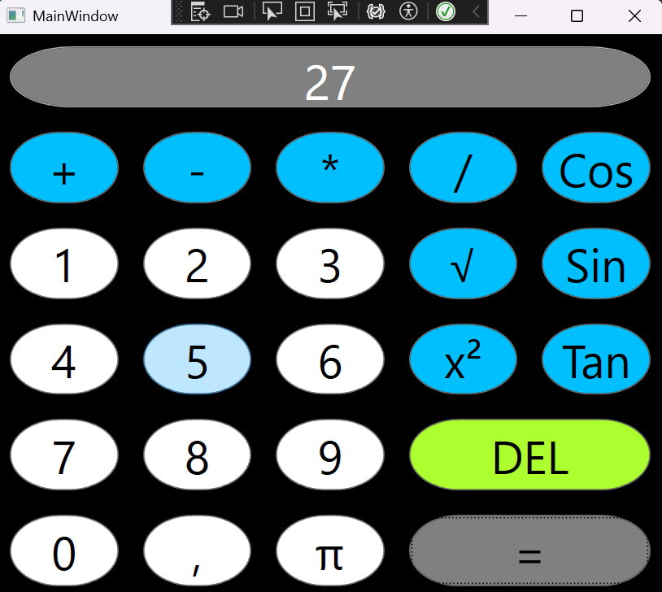

# Calculatrice WPF

Une calculatrice simple développée en C# avec .NET WPF.

## 🚀 Fonctionnalités

- Opérations de base : addition, soustraction, multiplication, division
- Interface utilisateur intuitive avec boutons et affichage
- Gestion des erreurs (ex: division par zéro)
- Support du clavier pour entrer les nombres et les opérations

## 🛠 Technologies utilisées

- C#
- .NET WPF
- XAML pour l'interface graphique

## 📸 Aperçu

Ajoutez ici une capture d'écran de l'interface de la calculatrice.



## 💻 Installation et exécution

1. Clonez le projet :
   ```sh
   git clone https://github.com/votre-utilisateur/votre-repo.git
   ```
2. Ouvrez le projet dans Visual Studio
3. Compilez et exécutez

## 📝 Auteurs

- **Coene Alexandre** - [GitHub](https://github.com/AlexandreCoene)
